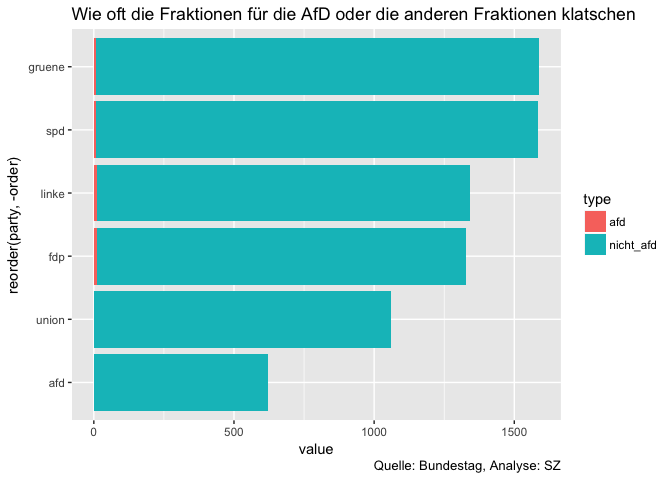

Daten zu den Bundestagsprotokollen
================
Katharina Brunner und Martina Schories
1.  April 2018

-   [Beschreibung der Daten](#beschreibung-der-daten)
-   [Beifall](#beifall)
    -   [Wieviel klatschen die Fraktionen für sich selbst und wieviel für die anderen?](#wieviel-klatschen-die-fraktionen-für-sich-selbst-und-wieviel-für-die-anderen)
    -   [Wenn eine Partei für andere klatscht, wie oft klatscht dann die ganze Fraktion und wann nur Teile einer Fraktion?](#wenn-eine-partei-für-andere-klatscht-wie-oft-klatscht-dann-die-ganze-fraktion-und-wann-nur-teile-einer-fraktion)
    -   [Wie viel klatschen die Fraktionen für andere?](#wie-viel-klatschen-die-fraktionen-für-andere)
-   [Lachen](#lachen)
    -   [Welche Fraktion lacht wie oft?](#welche-fraktion-lacht-wie-oft)
    -   [Über wen lacht die AfD?](#über-wen-lacht-die-afd)
    -   [Bei welchen Rednern lachen die Fraktionen (ohne AfD)?](#bei-welchen-rednern-lachen-die-fraktionen-ohne-afd)

Beschreibung der Daten
----------------------

<table style="width:100%;">
<colgroup>
<col width="8%" />
<col width="81%" />
<col width="7%" />
<col width="3%" />
</colgroup>
<thead>
<tr class="header">
<th>Column</th>
<th>Description</th>
<th>Type</th>
<th></th>
</tr>
</thead>
<tbody>
<tr class="odd">
<td>sitzung_id</td>
<td>The number of the debate</td>
<td>int</td>
<td></td>
</tr>
<tr class="even">
<td>text</td>
<td>original text from protocol</td>
<td>chr</td>
<td></td>
</tr>
<tr class="odd">
<td>type</td>
<td>type of action: Beifall, Heiterkeit, Lachen, Widerspruch, Zuruf</td>
<td>chr</td>
<td></td>
</tr>
<tr class="even">
<td>party</td>
<td>assigned party to action like clapping or interrupting</td>
<td>chr</td>
<td></td>
</tr>
<tr class="odd">
<td>zurufer_name</td>
<td>name of the person who interrupts</td>
<td>chr</td>
<td></td>
</tr>
<tr class="even">
<td>zuruf_text</td>
<td>text of the interruption</td>
<td>chr</td>
<td></td>
</tr>
<tr class="odd">
<td>speaker_party</td>
<td>party of the speaker</td>
<td>chr</td>
<td></td>
</tr>
<tr class="even">
<td>speaker_name</td>
<td>the name of the person currently speaking (notion: the speaker is not neccessarily the person at the lectern, e.g. when there is an interposed question)</td>
<td>chr</td>
<td></td>
</tr>
<tr class="odd">
<td>speech_id</td>
<td>id of the speech from XML file</td>
<td>chr</td>
<td></td>
</tr>
<tr class="even">
<td>top</td>
<td>agenda item</td>
<td>chr</td>
<td></td>
</tr>
<tr class="odd">
<td>beschreibung</td>
<td>description of agenda item</td>
<td>chr</td>
<td></td>
</tr>
<tr class="even">
<td>zwischenfrage</td>
<td>is the speaker asking a question? If yes <code>1</code>, if no <code>0</code></td>
<td>int</td>
<td></td>
</tr>
<tr class="odd">
<td>party_action</td>
<td>is the whole party clapping, laughing... (<code>1</code>) or just parts (<code>0</code>)?</td>
<td>int</td>
<td></td>
</tr>
</tbody>
</table>

``` r
library(dplyr)
```

    ## 
    ## Attaching package: 'dplyr'

    ## The following objects are masked from 'package:stats':
    ## 
    ##     filter, lag

    ## The following objects are masked from 'package:base':
    ## 
    ##     intersect, setdiff, setequal, union

``` r
library(ggplot2)
library(tidyr)

# import data
df <- read.csv("data/bundestagsprotokolle_19.csv", sep = "\t", stringsAsFactors = F)
```

Beifall
-------

### Wieviel klatschen die Fraktionen für sich selbst und wieviel für die anderen?

``` r
party_vector <- c("afd", "fdp", "gruene", "linke", "spd", "union")

df_beifall_self <- df %>%  
  filter(type == "beifall", party == speaker_party) %>% 
  count(party) %>% 
  rename(self = n)

df_beifall_others <- df %>% 
  filter(type == "beifall", party != speaker_party) %>% 
  count(party)  %>% 
  rename(others = n)

df_beifall_all <- df %>%
  filter(type == "beifall") %>% 
  count(party) %>% 
  rename(all = n)

df_beifall_all %>% 
  left_join(df_beifall_self, by = "party") %>% 
  left_join(df_beifall_others, by = "party") %>% 
  mutate(share_self = self/all,
         share_others = others/all) %>% 
  filter(party %in% party_vector) %>% 
  arrange(desc(share_self)) %>% 
  mutate(order = row_number()) %>% 
  tidyr::gather(type, factor, 5:6) %>% 
  ggplot(aes(x = reorder(party, -order), y = factor, group = type, fill = type)) +
    geom_bar(stat = "identity") +
    scale_y_continuous(labels = scales::percent) +
    coord_flip() +
    labs(title = "Anteil des Beifalls für die eigene Fraktion und andere Fraktionen")
```


### Wenn eine Partei für andere klatscht, wie oft klatscht dann die ganze Fraktion und wann nur Teile einer Fraktion?

Die AfD klatscht deutlich weniger für andere. Und wenn sie es doch tut, dann sind das vor allem einzelne Abgeordnete oder nur Teile der Fraktion.

``` r
df %>% 
  filter(type == "beifall", party != speaker_party) %>% 
  count(party, party_action) %>% 
  spread(party_action, n) %>% 
  mutate(sum =  `0` +`1`) %>% 
  arrange(desc(sum)) %>% 
  mutate(order = row_number()) %>% 
  rename(ganze_partei = `0`, teile_der_partei = `1`) %>% 
  gather(party_action, value, -party, -sum, -order) %>% 
  ggplot(aes(x = reorder(party, -order), y = value, group = party_action, fill = party_action)) +
  geom_bar(stat = "identity") +
  coord_flip()
```

    ## Warning: Removed 1 rows containing missing values (position_stack).


### Wie viel klatschen die Fraktionen für andere?

Und wieviel Aufmerksamkeit bekommt die AfD von den anderen Parteien?

``` r
df %>%  
  filter(type == "beifall", party != "alle", party != speaker_party) %>% 
  count(party, speaker_party) %>% 
  filter(party %in% party_vector, speaker_party %in% party_vector) %>% 
  spread(speaker_party, n) %>% 
  rowwise() %>% 
  mutate(nicht_afd = sum(fdp, gruene, linke, spd, union, na.rm= TRUE)) %>% 
  arrange(desc(nicht_afd)) %>% 
  mutate(order = row_number()) %>% 
  select(party, afd, nicht_afd, order) %>% 
  gather(type, value, -order, -party) %>% 
  ggplot(aes(x = reorder(party, -order), y = value, fill = type, group = desc(type))) +
  geom_bar(stat = "identity") +
  coord_flip() +
  labs(title= "Wie oft die Fraktionen für die AfD oder die anderen Fraktionen klatschen",
       caption = "Quelle: Bundestag, Analyse: SZ")
```

    ## Warning: Removed 1 rows containing missing values (position_stack).


Lachen
------

### Welche Fraktion lacht wie oft?

``` r
df %>% 
  filter(type == "lachen") %>% 
  count(party) %>% 
  ggplot(aes(x = reorder(party, n), y = n)) +
  geom_bar(stat = "identity") +
  coord_flip() +
  labs(title = "Anzahl des Lachens pro Fraktion",
       caption = "Quelle: Bundestag, Analyse: SZ")
```


### Über wen lacht die AfD?

Die AfD lacht vor allem Sprecher der Union aus.

``` r
df %>% 
  filter(type == "lachen", party == "afd") %>% 
  group_by(party, speaker_party) %>% 
  summarise(n = n()) %>% 
  mutate(share = n/sum(n)) %>% 
  ggplot(aes(x = reorder(speaker_party, n), y = n)) +
  geom_bar(stat = "identity") +
  coord_flip() +
  labs(title = "Anzahl des Lachens der AfD pro Fraktion",
       caption = "Quelle: Bundestag, Analyse: SZ")
```



### Bei welchen Rednern lachen die Fraktionen (ohne AfD)?

Die anderen Parteien (insbesondere die SPD) lachen auch vor allem die AfD aus.

``` r
df %>% 
  filter(type == "lachen", party != "afd") %>% 
  group_by(party, speaker_party) %>% 
  summarise(n = n()) %>% 
  mutate(share = n/sum(n)) %>% 
  arrange(desc(n))
```

    ## # A tibble: 29 x 4
    ## # Groups:   party [5]
    ##    party  speaker_party      n  share
    ##    <chr>  <chr>          <int>  <dbl>
    ##  1 spd    afd               58 0.892 
    ##  2 gruene afd               48 0.696 
    ##  3 linke  afd               34 0.548 
    ##  4 union  afd               23 0.821 
    ##  5 fdp    afd               16 0.516 
    ##  6 linke  union             16 0.258 
    ##  7 gruene bundesminister     9 0.130 
    ##  8 fdp    spd                7 0.226 
    ##  9 gruene spd                4 0.0580
    ## 10 linke  bundesminister     4 0.0645
    ## # ... with 19 more rows
